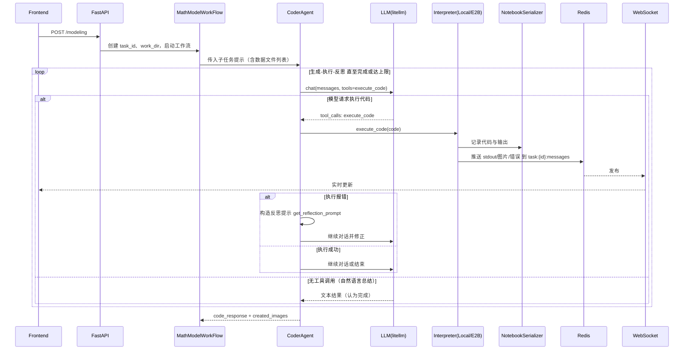

# MathModelAgent 架构图与 LangGraph 对照

本页给出系统模块依赖/调用关系图（Mermaid）与将当前实现映射到 LangGraph 概念（Nodes/Edges/State）的对照表，便于阅读与迁移。

## 系统架构（模块依赖/调用关系图）
```mermaid
graph TD
    %% Frontend & Transport
    FE[Frontend (Vue 3 + Vite)] -->|REST /modeling| API[FastAPI app]
    FE -->|WebSocket /task/{task_id}| WS[WS Router]

    subgraph FastAPI
      API --> R1[modeling_router]
      API --> R2[ws_router]
      API --> R3[common_router]
      API --> R4[files_router]
    end

    R1 --> WF[MathModelWorkFlow.execute()]

    %% Workflow creates Agents & Interpreter
    WF --> LLMF[LLMFactory]
    WF --> AG1[CoordinatorAgent]
    WF --> AG2[ModelerAgent]
    WF --> IF[InterpreterFactory]
    IF -->|no E2B_API_KEY| LCL[LocalCodeInterpreter\n(Jupyter Kernel)]
    IF -->|with E2B_API_KEY| E2B[E2BCodeInterpreter\n(AsyncSandbox)]
    WF --> NB[NotebookSerializer]

    %% Data workspace
    WF --> WD[work_dir (project/work_dir/{task_id})]
    NB --> WD
    LCL --> WD
    E2B <--> WD

    %% Coordinator -> Modeler -> Coder -> Writer
    WF -->|questions| AG1
    AG1 -->|questions JSON| AG2
    AG2 -->|solutions per subtask| AG3[CoderAgent]
    AG3 -->|code results/images| AG4[WriterAgent]

    %% CoderAgent -> LLM with tools
    AG3 -->|chat + tools| LLM[LLM(chat) via LiteLLM]
    LLM --> TOOLS[execute_code tool schema]
    TOOLS -->|call| EXEC[Interpreter.execute_code]
    EXEC --> NB

    %% Realtime messages
    subgraph Messaging
      RM[RedisManager]
    end
    WF --> RM
    AG1 --> RM
    AG2 --> RM
    AG3 --> RM
    AG4 --> RM
    LCL --> RM
    E2B --> RM
    WS --> RM
    RM --> WS
    WS --> FE

    %% Static exposure
    API --> STATIC[/static -> project/work_dir/]
```

## 子任务时序（Coder 执行与反思闭环）


## 与 LangGraph 概念对照
- Nodes（节点）
  - Coordinator: `CoordinatorAgent`
  - Modeler: `ModelerAgent`
  - Coder: `CoderAgent`（内部含工具节点 `execute_code`）
  - Writer: `WriterAgent`
  - Interpreter: `LocalCodeInterpreter` | `E2BCodeInterpreter`
  - I/O/Infra: `NotebookSerializer`、`RedisManager`（可视为观测/副作用节点）

- Edges（边）
  - 主流程：`Coordinator → Modeler → (for each subtask) Coder → Writer`
  - 工具调用：`Coder → execute_code → Interpreter`
  - 结果回流：`Interpreter → Redis → WS → Frontend`（可视为外部观测，不影响主图拓扑）
  - 反思重试：`execute_code error → reflection_prompt → Coder LLM` 再次生成

- State（状态）
  - 会话状态：`Agent.chat_history`（系统/用户/助手/工具消息）
  - 工区状态：`work_dir/project/work_dir/{task_id}`（数据、图片、notebook、最终文档）
  - 可视化状态：`NotebookSerializer.segmentation_output_content`
  - 流水状态：`Redis task:{task_id}:messages`（前端订阅）
  - 配置状态：`settings`（API keys、Base URLs、E2B 开关、OpenAlex Email）

## 关键文件索引
- Workflow/Agents: `app/core/workflow.py`、`app/core/agents/*`
- LLM & Tools: `app/core/llm/llm.py`、`app/core/functions.py`
- Interpreter: `app/tools/interpreter_factory.py`、`app/tools/local_interpreter.py`、`app/tools/e2b_interpreter.py`
- I/O & Messaging: `app/tools/notebook_serializer.py`、`app/services/redis_manager.py`
- WorkDir & 文档: `app/utils/common_utils.py`（`create_work_dir`、`md_2_docx`）

## 查看方式
- GitHub/VS Code 预览支持 Mermaid；若需本地预览，VS Code 可安装 Markdown Preview Mermaid 支持。
